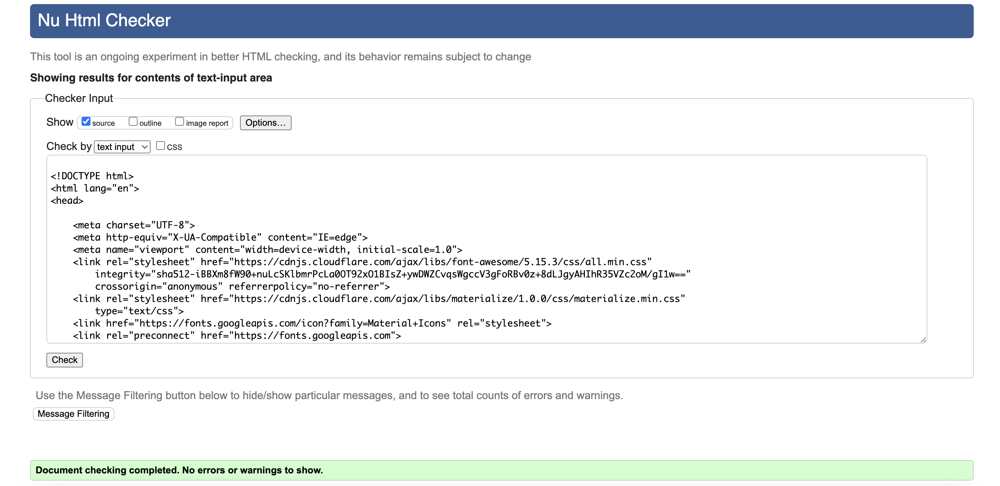
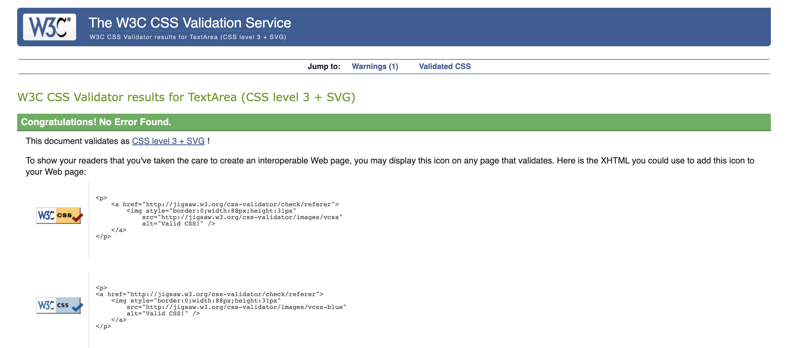
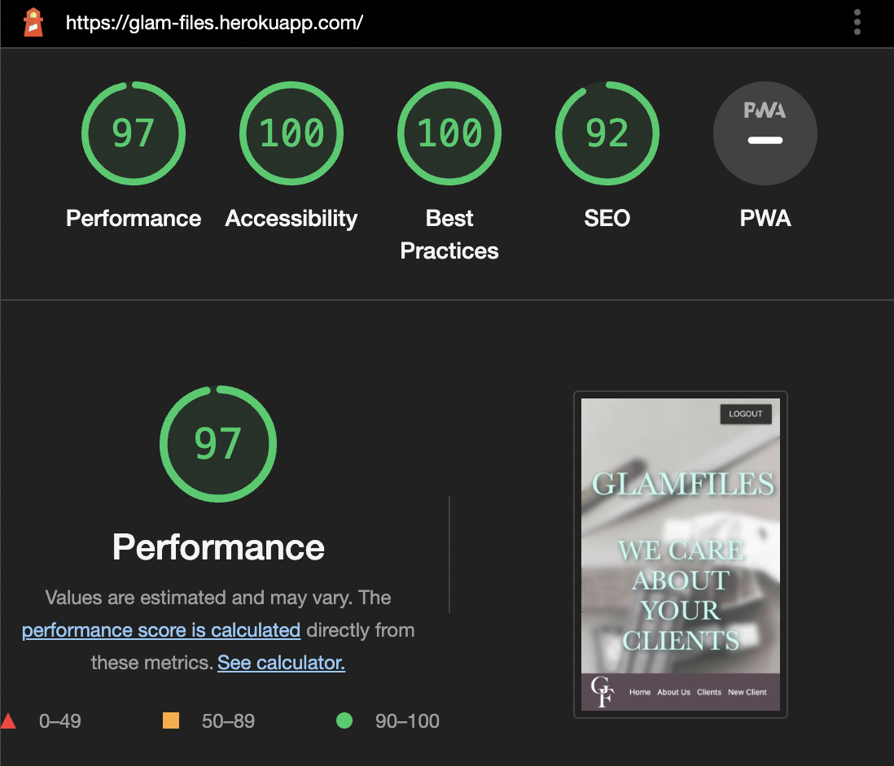
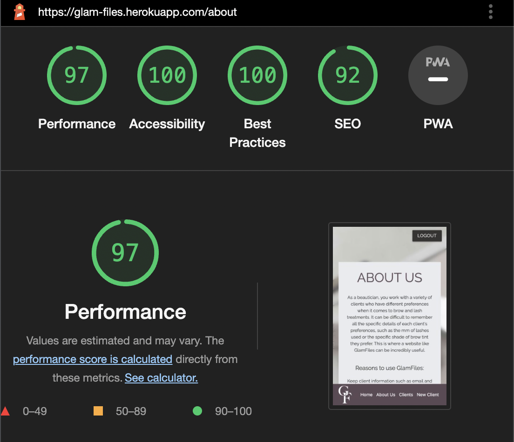
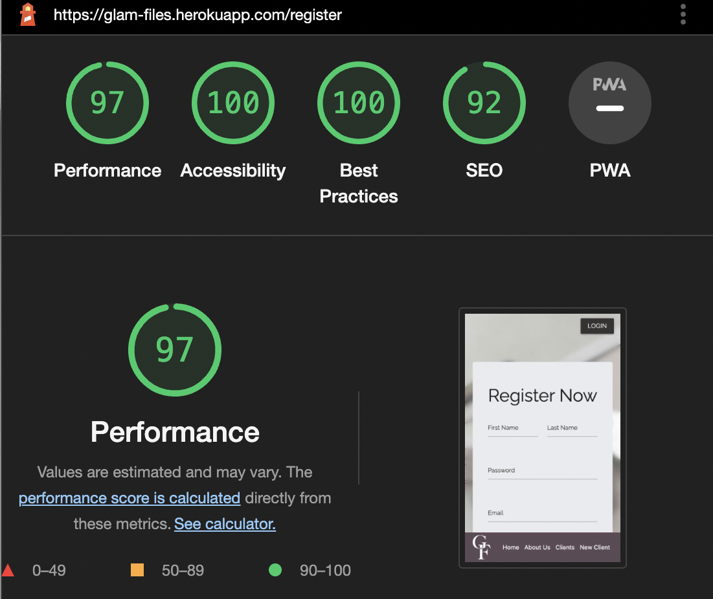
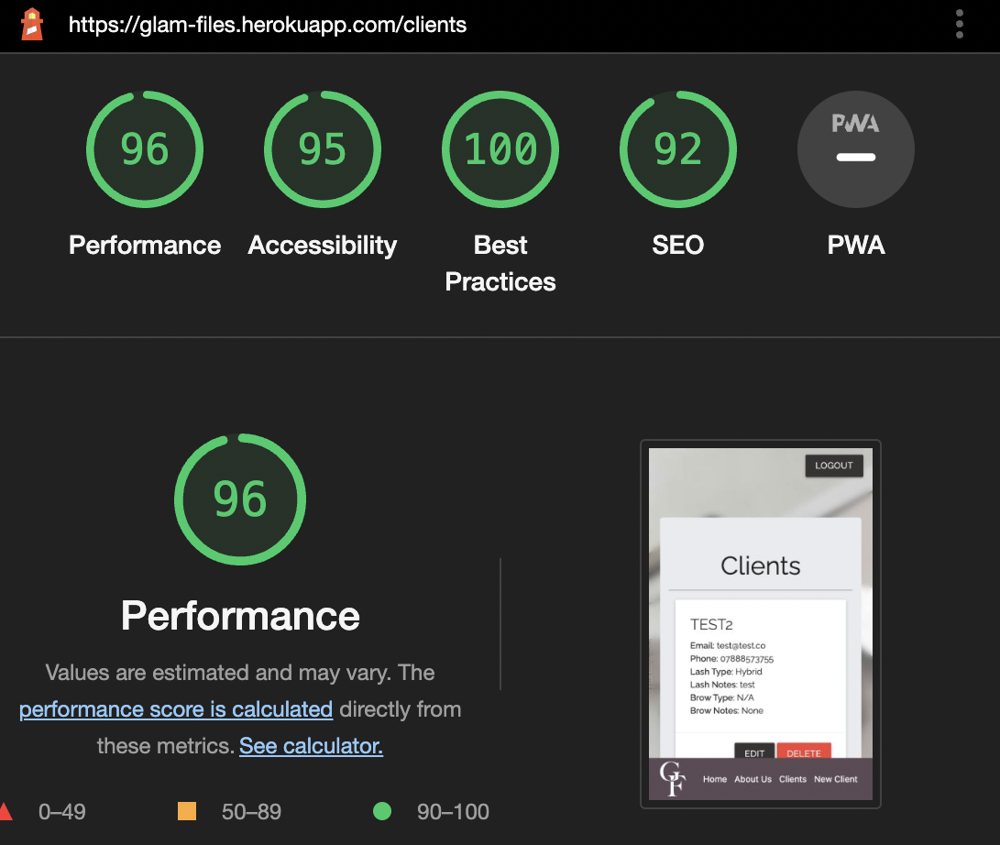
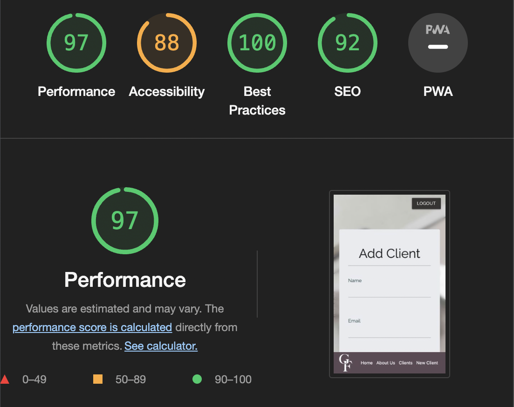
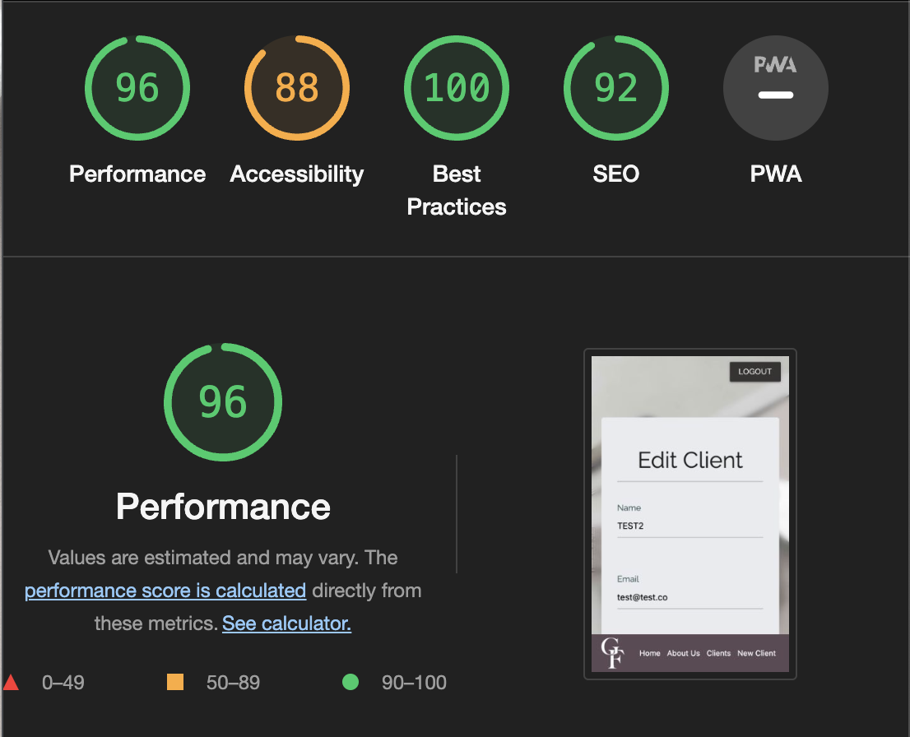
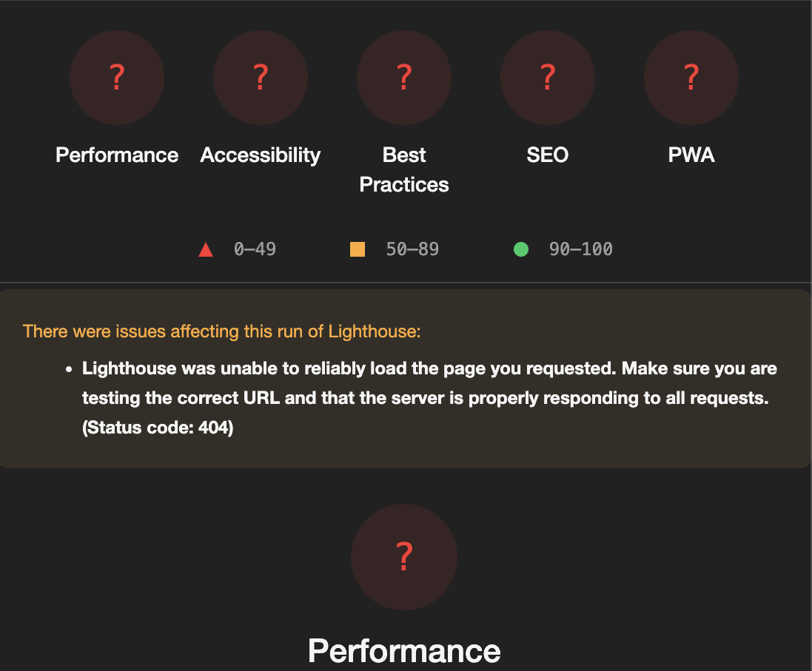

# Glam Files | Data Storing

## Save Client Data | Easy Way to Store Info
-------
[![VisitWebsite][website-shield]][website-url]&nbsp;&nbsp;
[![Issues][issues-shield]][issues-url]&nbsp;&nbsp;
[![ClosedIssues][closed-shield]][closed-url]&nbsp;&nbsp;
[![LinkedIn][linkedin-shield]][linkedin-url]


## Table of Contents 

- <details open>
    <summary><a href="#ux">UX</a></summary>

    <ul>
    <li><details>
    <summary><a href="#goals">Goals</a></summary>

    - [Business Goals](#business-goals)
    - [User Goals](#user-goals)
    - [Strategy](#strategy)
    </details></li>

    <li><details>
    <summary><a href="#visual-design">Visual Design</a></summary>
    
    - [Fonts](#fonts)
    - [Styling](#styling)
    - [Wireframes](#wireframes)
    - [Database Schema](#schema) 
    - [Surface](#surface)
    - [Coolors](#coolors)
    </details></li>
    </ul>
 </details>

- <details open>
    <summary><a href="#features">Features</a></summary>

    <ul>
    <li><details>
    <summary><a href="#features">Page Features</a></summary>

    - [Navbar & Footer](#navbar-footer)
    - [Home](#home)
    - [About Us](#about-us)
    - [Register](#register)
    - [Login/Logout](#login-logout)
    - [Clients](#clients)
    - [Add Client](#add-client)
    </details></li>

    <li><details>
    <summary><a href="#other-features">Other Features</a></summary>
    
    - [Edit](#edit)
    - [Delete](#delete)
    - [404](#404)

    </details></li>
    </ul>
 </details>

- <details open>
    <summary><a href="#testing">Testing</a></summary>

    <ul>
    <li><details>
    <summary><a href="web-testing">Web Testing</a></summary>

    - [Responsiveness](#responsiveness)
    - [Validator](#validator-testing)
    - [Errors](#errors)
    - [Javascript](#javascript-testing)
    - [Functionality](#functionality-testing)
    - [User Story](#user-story-testing)
    - [Known Bugs](#user-story-testing)
    - [Resolved Bugs](#user-story-testing)

    </details></li>

    <li><details>
    <summary><a href="#visual-design">Other Testing</a></summary>
   
    - [General](#general-testing)
    - [Mobile](#mobile-testing)
    - [Desktop](#desktop-testing)
    - [Accessibility](#accessibility-testing)

    </details></li>
    </ul>
 </details>


- <details open>
    <summary><a href="#acknowledgments ">Acknowledgements</a></summary>

    <ul>
    <li><details>
    <summary><a href="#recognition">Recognition</a></summary>

    - [Built With](#built-with)
    - [Media](#media)
    - [Credits](#credits)
    </details></li>

    <li><details>
    <summary><a href="#deployment">Deployment</a></summary>
    
    - [Preparation](#preparation)
    - [Instructions](#instructions)
    - [Installation](#installation)
    </details></li>
    </ul>
 </details>


# User Experience 

## Goals

### Business Goals
------
1. Streamline client management and record-keeping processes for the beautician
2. Improve the overall efficiency and organization of the beautician's business
3. Increase client retention by providing a more personalized and streamlined experience
4. Boost profitability by identifying trends and patterns in client behavior and preferences


### User Goals
------
1. Easily access and update client information in one central location
2. View past client interactions and appointment history
3. Receive alerts and reminders for upcoming appointments and important client events
4. Analyze client data to identify areas for improvement and growth in the business

### Strategy
-------
Considering the core UX principles I first started to think about the strategy for this website and defined who the target users would be and what features/technologies they would want.

Glam Files target users are:

Aged 18-60 primarily women 

What these users would be looking for:

Streamlined and easy-to-use client management system

Access to client information in one central location

Ability to edit and update client information if there are any changes

Be able to delete a client profile if it is no longer needed or if the information is incorrect

The ability to log in to the web application with my credentials so that I can access my client profiles securely

To be able to log out of the web application so that I can ensure the security of my client data

[Back to top](#table-of-contents)

## Visual Design

### Fonts 
------

### Styling 
------


### Wireframes
------
[![Desktop-Wireframe]][desktop-wireframe]
[![iPad-Wireframe]][ipad-wireframe]
[![iPhone-Wireframe]][iphone-wireframe]

### Database Schema 
-------
The schema defines the structure of the Client and User models, including their attributes and relationships, allowing you to store and retrieve data in a database using SQLAlchemy. The Client model represents information about clients, such as their name, contact details, lash and brow types, notes, and the associated user. The User model represents user information, including their name, email, password, and a relationship to their clients. With this schema, you can perform operations like creating, updating, and deleting clients in the database.
![Database-Schema]

### Surface
------
I chose a colour palette based around the hero image, I put the image into photoshop and copied a few of the colours inside of the image. I wanted this to be reflected on the website. I paired these colours with a dark slate grey and a lighter blue to contrast the more muted colours in the image. 

### Coolors
------
Using the coolors palette on the image I selected the colours from this palette and also a darker and lighter shade of contrasting colours to create a balances palette. 


I used Google fonts 'Libre Baskerville' and 'Raleway'. I used the Libre font to make the initial text stand out from the regular font on the site. I then used 'Raleway' as I thought it was very easy to read and looks professional.

# Features

This is a fully responsive website that was designed mobile-first as this is the most likely way it will be viewed; the website is divided into the 9 pages, 6 of which have buttoned links on the index page. The edit client page is not available until the user is logged into the website. There is also a 404 page for when someone ends up on an incorrect page. All of the headings use the font Raleway and the body too, this consistency has been used across the website to create a coherent design.

## Page Features

### Navbar Footer
-------
The navbar is comprised of login button for users to login to their client database. The footer consists of the logo and menu items, including a home, about us, client and new client button. The client and add client button are rerouted to the register page for a user to log in before being able to view clients. 


### Home
---------
The home page is made with warm and calm colours to entice users to the site. It's basic in palette to ensure the infomation is very clear and readable. It gives an overview of the purpose of the site along with a button to immediately register. 

Features: 

1. Navbar with a login/logout button
2. Name of the website, an inspiring quote, a paragraph about the purpose of the site and a register button
3. Footer with logo and nav bar links to other pages


### About Us
--------
This pages gives further detail on the uses and benefits to using the website. It also includes another register button, this makes it easier for users to immediately create an account once reading more about the purpose. 

Features:

1. An intro paragraph about the stresses of remembering users info and the purpose of the webiste
2. A list of benefits to using the website 
3. A create account button for potential users to register and make an account


### Register 
---------
This page displays a register form for users to create and account and to start using the service. 

Features:

1. A form including, name password and email for users to create the account
2. A register button to submit the form
3. The page reroutes to the login page for users to log in and user the service 


### Login Logout
---------
This page is where users can log into or out of their account to see their client list and notes.  

Features:

1. A page where users can login using their premade account info
2. A login button that redirects to client page for using to immediately see client data
3. A logout button that takes the user back to the homepage 


### Clients 
---------
This page shows all client data available. There are cards for each clients where all data added by the user is visible to them 

Features:

1. A page where users can view client data
2. An edit button for users to edit and make changes to client data
3. A delete button for users to delete a client if needed, a pop up message appears to confirm deletion
4. Pop up messages appear when a user is created, edited or deleted to confirm to the user any changes made 


### Add Client
-------
This is a page where users can create a new client to add to the database

Features:

1. A form for users to add new client data
2. The name, email and phone number are required fields to submit the form
3. The note boxes are uneditable under an option from the dropdown is selected to ensure no unneeded information is added to the database 
4. A submit button that pushes the data to the client page 


### Edit 
--------
This page is where users can edit a specific client the info is pre-populated into the form for easy changes to be made.   

Features:

1. A pre-populated form of the specific client data they have added
2. A submit button for the user to push data to the client page


## Other Features 

### Delete
-------
This is a feature on the client page where a user can immediately delete a client they no longer have. After selecting delete a popup appears to confirm deletion, this is to avoid accidental deletion of client data. 


### 404
-----
This page is for errors, if a user types in an incorrect url name or an incorrect url name is generating they are routed to the 404 page which then gives you the option to return to the homepage. 


[Back to top](#table-of-contents)

# Testing 

## Web Testing 

### Responsiveness 
-------
These tests have been completed on mobile and desktop. 

| Page | Test | Functioning |
| --------------- | --------------- | --------------- |
| Website | Navbar | ✓ |
| Website | Footer | ✓ |
| Website | Menu | ✓ |
| Website | Spelling & Viewing | ✓ |
| Index | Page Responsiveness | ✓ |
| Index | Navigation Links Correctly | ✓ |
| About Us | Page Responsiveness | ✓ |
| About Us | Button Responsiveness | ✓ |
| Register | Page Responsiveness | ✓ |
| Register | Form Submits | ✓ |
| Register | Button Responsiveness | ✓ |
| Login | Page Responsiveness | ✓ |
| Login | Form Responsiveness | ✓ |
| Login | Form Submits | ✓ |
| Clients | Page Responsiveness | ✓ |
| Clients | Button Responsiveness | ✓ |
| Edit Client | Page Responsiveness | ✓ |
| Edit Client | Form Submits | ✓ |
| Edit Client | Button Responsiveness | ✓ |
| Edit Client | Pop Up Message | ✓ |
| Edit Client | Data Returns | ✓ |
| Delete Client | Page Responsiveness | ✓ |
| Delete Client | Button Responsiveness | ✓ |
| Delete Client | Pop Up Message | ✓ |
| Delete Client | Data Removed | ✓ |
| Add Client | Page Responsiveness | ✓ |
| Add Client | Form Submits | ✓ |
| Add Client | Button Responsiveness | ✓ |
| Add Client | Pop Up Message | ✓ |
| Add Client | Data Returns | ✓ |
| 404 | Page Responsiveness | ✓ |
| 404 | Button Responsiveness | ✓ |

### Validator Testing
---------
I did not add alt tags to the page as I had to add the images to the css for it to work, aria-label tags added instead. 

| Page | Test | No Errors |
| --------------- | --------------- | --------------- |
| Index | Validator HTML | ✓ |
| About Us | Validator HTML | ✓ |
| Register | Validator HTML| ✓ |
| Login | Validator HTML | ✓ |
| Clients | Validator HTML| ✓ |
| Edit Client | Validator HTML| X |
| Add Client | Validator HTML| ✓ |
| 404 | Validator HTML| ✓ |
| Website | Validator CSS | ✓ | 

HTML Validator
----


CSS Validator
----


### Errors
--------
Edit Client, fails with an error noting that I cannot have multiple selected options without the multiple function. I do not need the multiple function as this is only a one option dropdown. The other 'option' that is suggested it is setting is a disabled option merely for identifying this is a dropdown menu. 

### Javascript Testing
--------
JSHINT - tested on all javascript in js folder and inside of html. 

| Warning | Reasoning |
| --------------- | --------------- |
| 7 warnings ‘esversion 6’ to be installed to function | Code functioning fine but file added called ‘.jshintsc’ with code added to avoid this error appearing |
| 1 undefined variable ‘M’ | Relates to the Materialize framework I am using for this project |
| 1 unused variable instances | Used to call functions that initialise Materialize modals. The instances modal calls a dialog box that overlays the content to delete a client from the database and is needed for that process to function |


JSLINT - tested on all javascript in js folder and inside of html. 

| Warning | Reasoning |
| --------------- | --------------- |
| 2 undefined variable 'M' | Relates to the Materialize framework I am using for this project |

### Functionality 
------ 
### User Story
-------
Step-by-Step Walkthrough
To evaluate the usability of the website for beauticians managing client information, I will provide a step-by-step walkthrough of someone using the site, highlighting key interactions and evaluating the user experience.

Account Creation:
    * User accesses the website and proceeds to create an account as a beautician.
    * Key elements to test: Registration form, validation, and success message. 
    * Steps:
        1. User navigates to the registration page and fills out the required information.
        2. User submits the form and verifies if the validation is properly implemented by checking that it is a unique email address. 
        3. User receives a success message confirming the account creation.
    * Outcome: The account creation process is intuitive, and the user receives clear feedback on successful account creation.
Login Process:
    * User logs in to the website using their credentials.
    * Key elements to test: Login form, authentication process, and error handling.
    * Steps:
        1. User enters their username/email and password on the login page.
        2. User submits the form and verifies if the authentication process is seamless.
        3. User receives appropriate error messages if invalid credentials are provided.
    * Outcome: The login process is user-friendly, secure, and provides clear feedback on login success or failure.
Client Information Management:
    * User navigates to the client management section to perform CRUD (Create, Read, Update, Delete) operations on client information.
    * Key elements to test: Client listing, creation, editing, deletion, and data validation.
    * Steps:
        1. User views the list of existing clients and ensures that the information is displayed correctly.
        2. User creates a new client entry, providing necessary details such as name, email, phone, lash type, lash notes, brow type, and brow notes.
        3. User edits an existing client's information and verifies that the changes are saved accurately.
        4. User deletes a client entry and confirms the deletion prompt.
        5. User tests data validation by entering invalid or incomplete information during client creation or editing.
    * Outcome: The client management functionality allows users to easily add, edit, and delete client information, and proper data validation ensures the accuracy and integrity of the data. 
Overall Navigation and User Experience:
    * User explores different sections of the website, including menus, navigation links, and interactive elements.
    * Key elements to test: Navigation, responsiveness, and overall user experience.
Steps:
        1. User navigates through the website using the menus and links to access different pages.
        2. User tests the responsiveness of the website by accessing it on different devices or screen sizes.
        3. User interacts with various elements, such as buttons, forms, and filters, to evaluate the overall user experience.
    * Outcome: The website provides intuitive navigation, adapts well to different devices, and offers a smooth and pleasant user experience

### Known Bugs
--------
### Resolved Bugs 
-------

## Other Testing 

### General Testing
--------
- Every time a feature was added, all functions were tested to see if there was an impact.
- All forms have validation and will not submit without the proper information.
- The site was sent to friends for feedback and testing.
- All buttons tested thorughly myself and through friends using the website. 
- 404 page tested by entering incorrect route name in the URL.
- Edit and delete function tested several times to ensure correct functioning. 

### Mobile Testing
--------
- I tested the site personally on my Apple device, going through the entire process, checking buttons, functions, checking out, etc. I was personally unable to test on Android.
- I also tested the site on the following screens sizes on chrome: iPhone SE, iPhone XR, iPhone 12 Pro, Pixel 5, Samsung Galaxy S8+, Samsung Galaxy S20 Ultra, iPad Air, iPad Mini, Surface Pro 7, Surface Duo, Galaxy Fold, Samsung Galaxy A51, Nest Hub and Nest Hub Max. 
- The site was sent to friends and relatives for them to follow the same process. 
- Chrome was utilised to inspect the site in mobile format, going through the pages and functions.

### Desktop Testing
-------
- The site was developed on a Macbook Air and the majority of testing occurred on Chrome.
- The site was tested by friends and relatives on numerous desktop devices.
- The site was marginally tested on other browsers, such as Firefox and Edge.

### Accessibility Testing
-------
All pages were tested using Lighthouse on Chrome in desktop and mobile view. 

Index          |  About Us
:-------------------------:|:-------------------------:
  |  

Register          |  Login
:-------------------------:|:-------------------------:
  |  

Clients          |  New Client
:-------------------------:|:-------------------------:
  |  

Edit          |  404
:-------------------------:|:-------------------------:
  |  

# Acknowledgements 

## Recognition 

### Credits
--------
| Issue | Guidance | 
| --------------- | --------------- | 
| Used to remove the shadow and line from the header | https://stackoverflow.com/questions/51750706/how-to-turn-off-materializes-default-shadows-for-navbar |
| Framework templates | https://materializecss.com/footer.html |
| Rerun application where I can see edits in html | https://sentry.io/answers/auto-reloading-a-flask-application/ |
| Hero image | https://unsplash.com/s/photos/lash-extensions |
| SQL Alchemy tutorial | https://www.youtube.com/watch?v=jaKMm9njcJc&list=PL4iRawDSyRvVd1V7A45YtAGzDk6ljVPm1 |
| Login authentication | https://www.digitalocean.com/community/tutorials/how-to-add-authentication-to-your-app-with-flask-login | 
| Login template | https://flask-login.readthedocs.io/en/latest/#login-example |
| Links created to navigation pages | https://flask.palletsprojects.com/en/2.1.x/blueprints/ | 
| Error handler | https://flask.palletsprojects.com/en/2.1.x/errorhandling/ |
| Dropdown javascript | https://flask.palletsprojects.com/en/2.1.x/patterns/flashing/ |
| Pre populating forms | https://stackoverflow.com/questions/1085801/get-selected-value-in-dropdown-list-using-javascript | 
| Updating the database | https://realpython.com/flask-connexion-rest-api-part-2/#prepopulating-form-fields |
| Deleting clients | https://realpython.com/flask-by-example-updating-the-ui/ | 
| Responsive cards | https://materializecss.com/modals.html |
| Disabled text in forms | https://www.w3schools.com/jsref/prop_text_disabled.asp | 
| Creating popups | https://w3bits.com/css-masonry/ |
| Messages added on CRUD functions | https://materializecss.com/toasts.html | 
| Flask tutorial | https://blog.miguelgrinberg.com/post/the-flask-mega-tutorial-part-xxiii-application-programming-interfaces-apis | 

### Known Bugs

UNRESOLVED BUG: cannot get js for the client page to go into a separate file!!
UNRESOLVED BUG: when editing a user the text box remains uneditable until a user reselects the option

### Fixed Bugs 

BUG: logout message issue, taking to rendered clients.html and not reidrecting to clients premade, fixed
BUG: login and logout buttons not showing correctly once user was logged in, added if statement to button to check whether user was logged in and to amend button accordingly. 
BUG: database not loading to run on website, added code to route line 7 to fix error
BUG: favicon icon error 
BUG: users could not add client email addresses with the same email as another users clients. Connected the clients to users corerctly 
BUG: flash messages not appearing for crud functionality, created toast notifications instead. 
BUG: mobile nav bar not closing on second click, changed to desktop view in mobile for clearer functionality. Unresolved. 
BUG: code not all formatted correctly. Python code formatted to pep8 using autopep8, html manually formatted. 
BUG: receiving an error from js that lash brow text boxes dont exist on other pages 'script.js:17 Uncaught TypeError: Cannot set properties of null (setting 'disabled')
    at HTMLDocument.<anonymous> (script.js:17:30) - added a null check before executing code
BUG: allowing user to register without any info applied, changed html to required to avoid this 
BUG: error 500 when submitted pre used email address, added if statement in routes to check is user was already registered and flash message added 
BUG: allowing user to create another account when logged in, reroutes to client page

# Acknowledgements

## Recognition 

### Built With 

![HTML][html-shield]
![Python][python-shield]<br>
![Materialize][materialize-shield]
![CSS][css-shield]<br>
![Javascript][javascript-shield]
![FontAwesome][fonts-shield]<br>
![GoogleFonts][googlefont-shield]
![Photoshop][photo-shield]<br>
![Dreamweaver][dream-shield]
![Rory Patrick Sheridan][rory-shield]

## Deployment 

### Preparation
------
* To prepare for using GitHub, you can either copy or clone the repository for direct deployment.
* To get started, you'll need a free GitHub account, a free ElephantSQL account, a Heroku account and preferably some kind of image editor. 

### Installation 
------
1. Configure the Gitpod workspace:
    * After the workspace is created, it will need to be opened in your browser using gitpod. 
    * Install the relevant 
    * ```pip3 install Flask-SQLAlchemy psycopg2 flask-login```
    * Create your own env.py file with the following information 
    * ```import os
    * 
    * os.environ.setdefault("IP", "0.0.0.0")
    * os.environ.setdefault("PORT", "5000")
    * os.environ.setdefault("SECRET_KEY", "any_secret_key")
    * os.environ.setdefault("DEBUG", "True")
    * os.environ.setdefault("DEVELOPMENT", "True")
    * os.environ.setdefault("DB_URL", "postgresql:///treatments")```
    * Run the program with the following commands in gitpod to view and make changes 
    * ```set_pg
    * export FLASK_APP=run.py
    * flask run```

1. Set up the database connection:
    * Sign up for an ElephantSQL account (https://www.elephantsql.com/) if you haven't already.
    * Create a new database instance on ElephantSQL and make note of the connection URL.
2. Configure the Flask application to use SQLAlchemy and ElephantSQL:
    * Open the run.py file and add the necessary imports for SQLAlchemy and the PostgreSQL database:python
    * Replace <username>, <password>, <host>, <port>, and <database> in the SQLALCHEMY_DATABASE_URI with the corresponding details from your ElephantSQL database instance.
3. Create a Heroku account (https://www.heroku.com/) if you don't have one. 
ADD STEPS 

### Instructions 
------
1. To set up your repository on GitHub, log in to your account and navigate to https://github.com/nccadman19/glam-files
2. You can either create your own repository and copy or clone it, or you can fork the existing repository.
3. Use the git add, git commit, and git push commands to upload your files to the repository.
4. By default, GitHub Pages updates from the master branch. To make your website live, go to the Settings page of the repository and scroll down to the GitHub Pages section.
5. Select the Master Branch as the source and confirm your selection. After a minute or two, your website should be live and ready to view.


Welcome Nic,

This is the Code Institute student template for Gitpod. We have preinstalled all of the tools you need to get started. It's perfectly ok to use this template as the basis for your project submissions.

You can safely delete this README.md file, or change it for your own project. Please do read it at least once, though! It contains some important information about Gitpod and the extensions we use. Some of this information has been updated since the video content was created. The last update to this file was: **September 1, 2021**

## Gitpod Reminders

To run a frontend (HTML, CSS, Javascript only) application in Gitpod, in the terminal, type:

`python3 -m http.server`

A blue button should appear to click: _Make Public_,

Another blue button should appear to click: _Open Browser_.

To run a backend Python file, type `python3 app.py`, if your Python file is named `app.py` of course.

A blue button should appear to click: _Make Public_,

Another blue button should appear to click: _Open Browser_.

In Gitpod you have superuser security privileges by default. Therefore you do not need to use the `sudo` (superuser do) command in the bash terminal in any of the lessons.

To log into the Heroku toolbelt CLI:

1. Log in to your Heroku account and go to *Account Settings* in the menu under your avatar.
2. Scroll down to the *API Key* and click *Reveal*
3. Copy the key
4. In Gitpod, from the terminal, run `heroku_config`
5. Paste in your API key when asked

You can now use the `heroku` CLI program - try running `heroku apps` to confirm it works. This API key is unique and private to you so do not share it. If you accidentally make it public then you can create a new one with _Regenerate API Key_.

------

<!-- MARKDOWN LINKS & IMAGES -->
[desktop-wireframe]: /treatments/static/img/readme/desktop-wireframe.jpg
[ipad-wireframe]: /treatments/static/img/readme/ipad-wireframe.jpg
[iphone-wireframe]: /treatments/static/img/readme/iphone-wireframe.jpg
[issues-shield]: https://img.shields.io/badge/ISSUES-3%20OPEN-yellow?style=for-the-badge&logo=closed
[issues-url]: https://github.com/nccadman19/beau-belle/issues
[closed-shield]: https://img.shields.io/badge/CLOSED%20ISSUES-11%20CLOSED-blue?style=for-the-badge&logo=closed
[closed-url]: https://github.com/nccadman19/glam-files/issues?q=is%3Aissue+is%3Aclosed
[linkedin-shield]: https://img.shields.io/badge/-LinkedIn-black.svg?style=for-the-badge&logo=linkedin&colorB=555
[linkedin-url]: https://uk.linkedin.com/in/nicole-cadman-69a606230
[website-shield]: https://img.shields.io/badge/VISIT%20WEBSITE-HERE-green?style=for-the-badge&logo=closed
[website-url]: https://glam-files.herokuapp.com
[materialize-shield]: https://img.shields.io/badge/Materialize-orange?style=for-the-badge
[fonts-shield]: https://img.shields.io/badge/Font_Awesome-339AF0?style=for-the-badge&logo=fontawesome&logoColor=white
[googlefont-shield]: https://img.shields.io/badge/-Google%20Fonts-grey?logo=google&style=for-the-badge
[photo-shield]: https://img.shields.io/badge/Adobe%20Photoshop-31A8FF?style=for-the-badge&logo=Adobe%20Photoshop&logoColor=black
[dream-shield]: https://img.shields.io/badge/Adobe%20Dreamweaver-072401?style=for-the-badge&logo=Adobe%20Dreamweaver&logoColor=34F400
[css-shield]: https://img.shields.io/badge/CSS3-1572B6?style=for-the-badge&logo=css3&logoColor=white
[html-shield]: https://img.shields.io/badge/HTML5-E34F26?style=for-the-badge&logo=html5&logoColor=white
[javascript-shield]: https://img.shields.io/badge/JavaScript-323330?style=for-the-badge&logo=javascript&logoColor=F7DF1E
[python-shield]: https://img.shields.io/badge/Python-3776AB?style=for-the-badge&logo=python&logoColor=white
[rory-shield]: https://img.shields.io/badge/Rory%20Patrick%20Sheridan%20-MENTOR-lightgrey?style=for-the-badge&logo=closed
[database-schema]: /treatments/static/img/readme/database_schema.jpg

